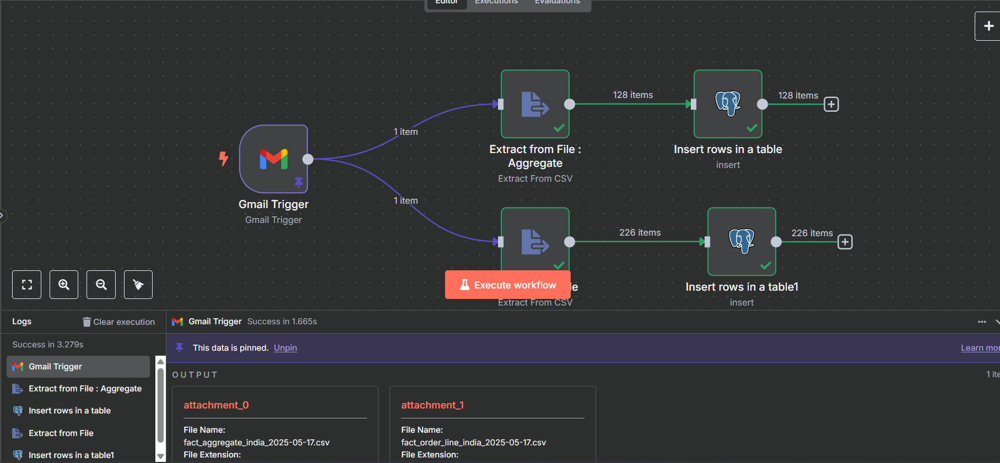

# Natural-Language-to-query

n8n agent collected data from Gmail and stores in PostgreSQL and finally get in sites in quadratic.

## Project Overview

This repository provides an integration where an n8n agent collects emails from Gmail, stores the data in a PostgreSQL database, and makes the information accessible on sites through quadratic queries.

## Features

- Automated data collection from Gmail
- Data storage in PostgreSQL
- Query interface for sites using quadratic
- Easy setup and deployment

## Usage

1. Configure your n8n agent to connect to your Gmail account.
2. Set up the PostgreSQL database.
3. Deploy the quadratic interface on your site.

## Image

_Add an image below by placing your image file in the repository and updating the path:_

## License

This project currently does not specify a license. Please add one if needed.

---
Repository: [Bhawneet1/Natural-Language-to-query](https://github.com/Bhawneet1/Natural-Language-to-query)
